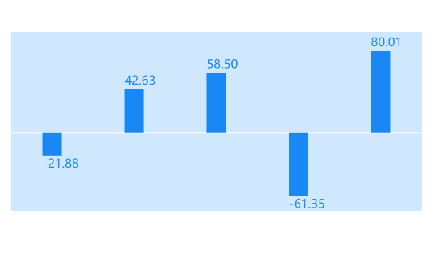
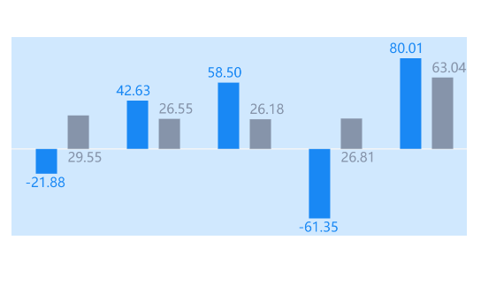
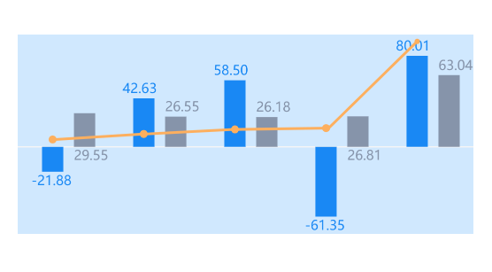

## columnChart 柱状图

该组件内部实现是采用 canvas 进行绘制，支持通过传参来展示特定的柱状图。

### 单柱模式

<br />
<div>
  
</div>

```html
<column-chart
  canvasId="column-chart1"
  mode="{{1}}"
  lineWidth="{{2}}"
  chink="{{8}}"
  height="{{300}}"
  list="{{oneList}}"
  mt="{{16}}"
  mb="{{13}}"
/>
```

### 双柱模式

<br />
<div>
  
</div>

```html
<column-chart
  canvasId="column-chart1"
  mode="{{2}}"
  lineWidth="{{2}}"
  chink="{{8}}"
  height="{{300}}"
  list="{{oneList}}"
  mt="{{16}}"
  mb="{{13}}"
/>
```

### 开启折线

<br />
<div>
  
</div>

```html
<column-chart
  canvasId="column-chart1"
  mode="{{2}}"
  isLine="{{true}}"
  lineWidth="{{2}}"
  chink="{{8}}"
  height="{{300}}"
  list="{{oneList}}"
  mt="{{16}}"
  mb="{{13}}"
/>
```

### 传入数据示例

```js
Page({
  data: {
    list: [
      {
        first_value: '-21.88',
        ratio: '6.46',
        last_value: '29.55'
      }
    ]
  }
})
```

### API

<br />

#### Props

| 参数           | 说明               | 类型    | 默认值     |
| -------------- | ------------------ | ------- | ---------- |
| canvasId       | canvas 实例 id     | String  | 空 -> 必填 |
| mode           | 模式 1 单柱 2 双柱 | Number  | 1          |
| width          | 画布宽度           | Number  | 686        |
| height         | 画布高度           | Number  | 226        |
| ml             | 左边距             | Number  | 0          |
| mt             | 上边距             | Number  | 0          |
| mr             | 右边距             | Number  | 0          |
| mb             | 下边距             | Number  | 0          |
| lineColor      | 折线颜色           | String  | #FDAF5E    |
| lineWidth      | 折线宽度           | Number  | 1          |
| list           | 数据               | Array   | []         |
| first_bar      | 首柱宽度           | Number  | 16         |
| last_bar       | 尾柱宽度           | Number  | 16         |
| chink          | 两柱间隔           | Number  | 4          |
| isLine         | 是否开启折线       | Boolean | false      |
| startLineColor | 起始线颜色         | String  | #f4f5f6    |
| firstBarColor  | 首柱颜色           | String  | #1988F4    |
| lastBarColor   | 尾柱颜色           | String  | #8694AA    |
| arcRadius      | 折线圆圈半径       | Number  | 2          |

#### list

| 参数        | 说明     | 类型   |
| ----------- | -------- | ------ |
| first_value | 首柱数据 | String |
| laste_value | 尾柱数据 | String |
| ratio       | 折线数据 | String |
