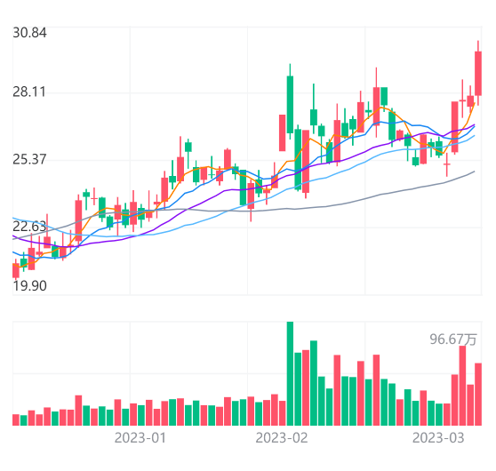
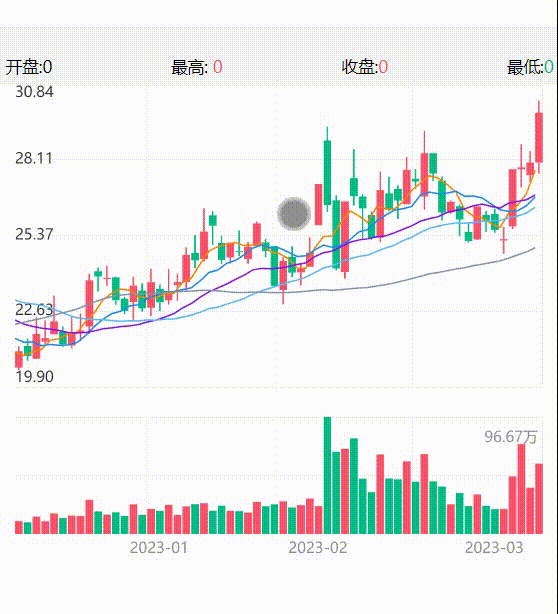
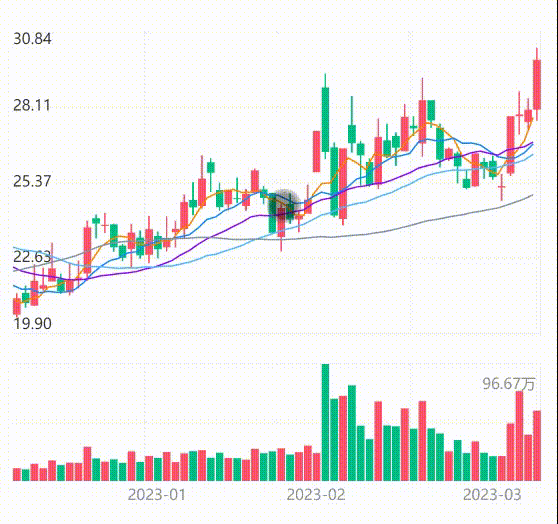

## dayLine K线图

该组件内部实现是采用 canvas 进行绘制，支持通过传参来展示特定的K线图。

### K线图
<br />
<div>
  
</div>

```html
<day-line 
    canvasId="dayline-chart" 
    space="{{40}}" 
    mb="{{56}}" 
    list="{{list}}"  
/>
```
此K线默认绘制了 5、10、20、30、60日均线

### 十字架
<br />
<div>
  
</div>

- 此十字架默认开启长按不动即可显示十字架,松手后过2s会自动清空
- clear方法是松开手后的事件
- stockInfo是移动十字架时触发会带上选中的日K参数,供外部渲染

```html
<day-line 
    canvasId="dayline-chart" 
    space="{{40}}" 
    mb="{{56}}" 
    list="{{list}}" 
    bind:clear="clear"
    bind:stockInfo="stockInfo" 
/>
```

### 拖动分页
<br />
<div>
  
</div>

拖动分页也是默认开启,只需要按住往左右拉即可进行分页


### API

<br />

#### Props
| 参数         | 说明                        | 类型    | 默认值     |
| ------------ | -------------------------- | ------- | ---------- |
| canvasId     | canvas 实例 id             | String  | 空 -> 必填 |
| width        | 画布宽度                   | Number  | 706        |
| topHight       | 分时区域高度                   | Number  | 404        |
| botHight       | 成交量区域高度                   |    Number  | 185        |
| space       | 中间间隙高度                   | Number  | 40        |
| list         | 主线数据                   | Array   | []         |
| mineLineNum         | 分时横线条数                   | Number   | 4         |
| verticalLineNum         | 分时竖向分隔线                   | Number   | 4         |
| gridWidth         | 网格背景线宽度                   | Number   | 4         |
| averageColor         | 均线颜色                   | string   | #FF8300         |
| gridColor         | 网格背景线颜色                   | string   |   #F4F5F6      |
| textColor         | 文字颜色                   | string   | #909399         |
| upColor         | 涨幅颜色                   | String   | #FE5269         |
| downColor         | 跌幅颜色                   | String   | #02BD85        |
| flatColor         | 平幅颜色                  | String   | #606266         |
| lineColor         | 分时线颜色                   | string   | #1988F4         |
| lineWidth         | 分时线宽度                   | Number   | 1         |
| cuurentActiveBgColor         | 侧边框背景颜色                   | string   | #E8E9EC         |
| currentActiveColor         | 侧边价格文字颜色                   | string   | #1988F4         |
| crossColor         | 十字架颜色                   | string   | #303133         |
| fiveDayColor         | 5日均线颜色                   | string   | #FF8300         |
| tenDayColor         | 10日均线颜色                   | string   | #1988F4         |
| twentyDayColor         | 20日均线颜色                   | string   | #880EF5         |
| thirtyColor         | 30日均线颜色                   | string   | #56B8FF         |
| sixtyColor         | 60日均线颜色                   | string   | #8694AA         |
| ml           | 左边距                     | Number  | 0          |
| mt           | 上边距                     | Number  | 0          |
| mr           | 右边距                     | Number  | 0          |
| mb           | 下边距                     | Number  | 0          |


#### list

| 参数 -> 下标        | 说明     | 类型   |
| ----------- | -------- | ------ |
| 0 | 时间 | Number |
| 1 | 开盘 | Number |
| 2 | 收盘 | Number |
| 3 | 最低价 | Number |
| 4 | 最高价 | Number |
| 5 | 成交量 | Number |
| 6 | MA5 | Number |
| 7 | MA10 | Number |
| 8 | MA20 | Number |
| 9 | MA30 | Number |
| 10 | MA60 | Number |


### Events
| 事件名       | 说明     |
| ----------- | -------- |
| stockInfo | 十字架选中日K数据 |
| clear | 松开十字架事件 |