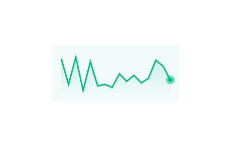
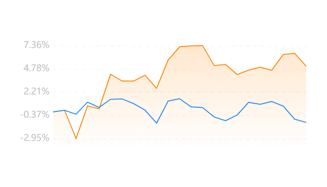
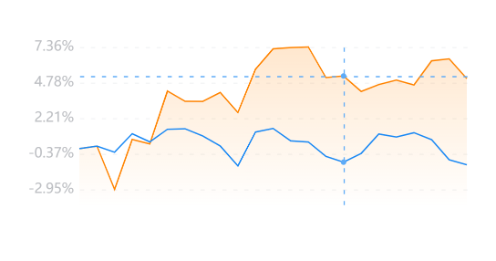

## lineChart 折线图

该组件内部实现是采用 canvas 进行绘制，支持通过传参来展示特定的折线。

### 上涨折线图

<br />
<div>
  
</div>

该图的适用场景是股票走势的略缩图。

```html
<line-chart
  canvasId="line-chart1"
  width="316"
  height="114"
  lineWidth="{{2}}"
  mr="{{2}}"
  list="{{list}}"
  mt="{{6}}"
  mb="{{6}}"
  ml="{{2}}"
  lastRadius="{{3}}"
  bgColor="254, 168, 179"
  lineColor="#FEA8B3"
/>
```

### 下跌折线图

<br />
<div>
  
</div>

```html
<line-chart
  canvasId="line-chart1"
  width="316"
  height="114"
  lineWidth="{{2}}"
  mr="{{6}}"
  list="{{downList}}"
  mt="{{6}}"
  dataLength="{{downList.length - 1}}"
  mb="{{6}}"
  ml="{{6}}"
  lastRadius="{{3}}"
  bgColor="2, 189, 133"
  lineColor="#02BD85"
/>
```

### 多线折线图

<br />
<div>
  
</div>

- 通过控制 isLabel 决定是否显示 label
- list 是主线、subList 是次线

```html
<line-chart
  canvasId="line-chart2"
  width="654"
  height="244"
  list="{{mainList}}"
  subList="{{subList}}"
  dataLength="{{mainList.length - 1}}"
  mt="{{5}}"
  mb="{{13}}"
  ml="{{40}}"
  mr="{{4}}"
  isLabel="{{true}}"
/>
```

### 开启十字架

<br />
<div>
  
</div>

- 通过控制 isMove 来决定触摸是否显示十字架

```html
<line-chart
  canvasId="line-chart2"
  width="654"
  isMove="{{true}}"
  height="244"
  list="{{mainList}}"
  subList="{{subList}}"
  dataLength="{{mainList.length - 1}}"
  mt="{{5}}"
  mb="{{13}}"
  ml="{{40}}"
  mr="{{4}}"
  isLabel="{{true}}"
/>
```

### 传入list示例

```js
// list格式如下
Page({
  data: {
    list: [{ value: 0.5 }, { value: 2 }]
  }
})
```

### API

<br />

#### Props

| 参数         | 说明                       | 类型    | 默认值     |
| ------------ | -------------------------- | ------- | ---------- |
| canvasId     | canvas 实例 id             | String  | 空 -> 必填 |
| width        | 画布宽度                   | Number  | 580        |
| height       | 画布高度                   | Number  | 166        |
| dataLength   | 数据节点数                 | Number  | 25         |
| list         | 主线数据                   | Array   | []         |
| subList      | 次线数据 如不传则不展示    | Array   | []         |
| isMove       | 是否开启十字架             | Boolean | false      |
| lineColor    | 主线颜色                   | String  | #FF8300    |
| lineWidth    | 主线宽度                   | Number  | 1          |
| subLineColor | 次线颜色                   | String  | #1988F4    |
| bgColor      | 主线背景色 只支持 rgb 格式 | String  | 255,131,0  |
| isArc        | 是否显示当前圆圈命中点     | Boolean | false      |
| arcColor     | 圆圈颜色                   | String  | #5EABF7    |
| crossColor   | 十字架颜色                 | String  | #5EABF7    |
| arcRadius    | 圆圈半径                   | Number  | 2          |
| isLabel      | 是否绘制标签               | Boolean | false      |
| labelNum     | 侧边标签数量               | Number  | 5          |
| lastRadius   | 最后一个节点圆圈半径       | Number  | 0          |
| ml           | 左边距                     | Number  | 0          |
| mt           | 上边距                     | Number  | 0          |
| mr           | 右边距                     | Number  | 0          |
| mb           | 下边距                     | Number  | 0          |

#### Events

| 事件名 | 说明                   | 回调参数 |
| ------ | ---------------------- | -------- |
| change | 十字架滑动选中节点数据 | Object   |

#### list

| 参数        | 说明     | 类型   |
| ----------- | -------- | ------ |
| value | 折线点数据 | Number |