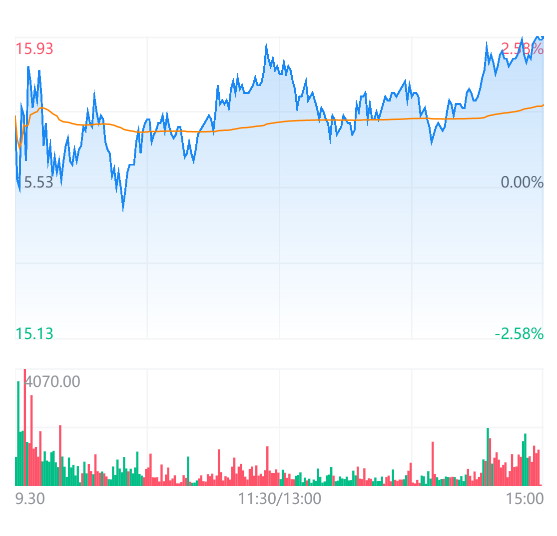
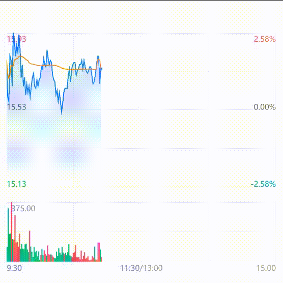
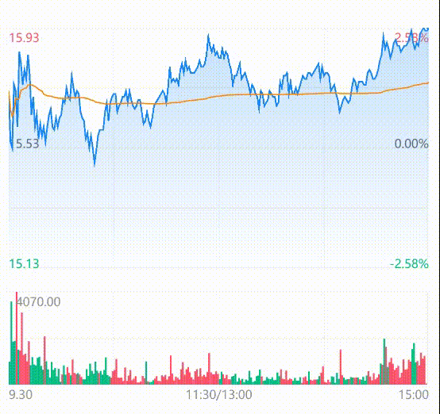

## minuteHourChart 分时图

该组件内部实现是采用 canvas 进行绘制，支持通过传参来展示特定的折线。

### 分时图
<br />
<div>
  
</div>

```html
<minute-hour-chart 
    id="minuteHour" 
    canvasId="minute-hour" 
    lineWidth="{{1}}" 
    base_info="{{base_info}}"
    list="{{list}}" 
    space="{{40}}" 
    mb="{{56}}" 
    averageColor="#FF8300" 
/>
```

### 实时绘制分时图

<br />
<div>
  
</div>

```html
<minute-hour-chart 
    id="minuteHour" 
    canvasId="minute-hour" 
    lineWidth="{{1}}" 
    base_info="{{base_info}}"
    list="{{list}}" 
    space="{{40}}" 
    mb="{{56}}" 
    averageColor="#FF8300" 
/>
```
主要是获取到数据后调用方法对画布进行清空然后在进行渲染。
```js
// 获取组件实例
this.component = this.selectComponent('#minuteHour');
// 此方法的作用是清空画布并重新绘制
this.component.clearCanvas();
```

### 十字架
<br />
<div>
  
</div>

### 传入list示例

```js
page({
    data: {
        list: ["9:30", 15.72, 15.72, 1233, 91],
        base_info: {
            prev_close_px: 10,
            new_price: 12
        }
    }
})
```

### API

<br />

#### Props
| 参数         | 说明                        | 类型    | 默认值     |
| ------------ | -------------------------- | ------- | ---------- |
| canvasId     | canvas 实例 id             | String  | 空 -> 必填 |
| width        | 画布宽度                   | Number  | 706        |
| topHight       | 分时区域高度                   | Number  | 404        |
| botHight       | 成交量区域高度                   |    Number  | 185        |
| space       | 中间间隙高度                   | Number  | 40        |
| dataLength   | 数据节点数                 | Number  | 240         |
| list         | 主线数据                   | Array   | []         |
| base_info         | 个股信息                   | Object   | {}         |
| mineLineNum         | 分时横线条数                   | Number   | 4         |
| verticalLineNum         | 分时竖向分隔线                   | Number   | 4         |
| gridWidth         | 网格背景线宽度                   | Number   | 4         |
| averageColor         | 均线颜色                   | string   | #FF8300         |
| gridColor         | 网格背景线颜色                   | string   |   #F4F5F6      |
| textColor         | 文字颜色                   | string   | #909399         |
| upColor         | 涨幅颜色                   | String   | #FE5269         |
| downColor         | 跌幅颜色                   | String   | #02BD85        |
| flatColor         | 平幅颜色                  | String   | #606266         |
| lineColor         | 分时线颜色                   | string   | #1988F4         |
| lineWidth         | 分时线宽度                   | Number   | 1         |
| cuurentActiveBgColor         | 侧边框背景颜色                   | string   | #E8E9EC         |
| currentActiveColor         | 侧边价格文字颜色                   | string   | #1988F4         |
| crossColor         | 十字架颜色                   | string   | #303133         |
| ml           | 左边距                     | Number  | 0          |
| mt           | 上边距                     | Number  | 0          |
| mr           | 右边距                     | Number  | 0          |
| mb           | 下边距                     | Number  | 0          |

#### list

| 参数 -> 下标        | 说明     | 类型   |
| ----------- | -------- | ------ |
| 0 | 时间 | Number |
| 1 | 分时价格 | Number |
| 2 | 分时均线 | Number |
| 3 | 成交量 | Number |
| 4 | 当前分钟开始成交量的差值 | Number |
| 5 | 当前分钟结束成交量的差值 | Number |

#### base_info
| 参数       | 说明     | 类型   |
| ----------- | -------- | ------ |
| prev_close_px | 昨收价 | Number |
| new_price | 最新价 | Number |